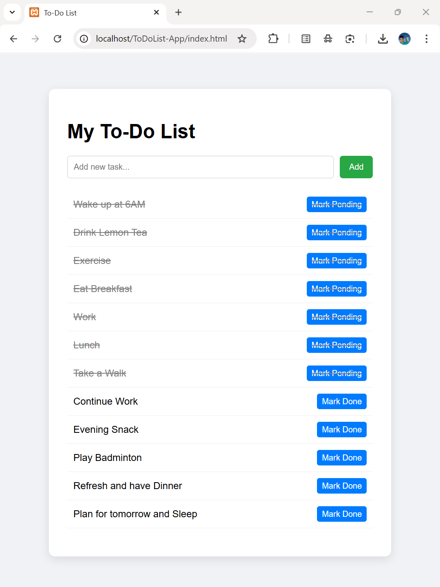

# My-To-Do-List
My To-Do List is a basic, functional web-based To-Do List application that allows users to manage their tasks.

# 📝 Web-Based To-Do List Application

This is a simple, functional **To-Do List web application** built using:
- **HTML** for structure
- **CSS** for styling
- **JavaScript** for client-side interactivity
- **PHP** for server-side data persistence (file-based, no database)

📌 The goal of this project was to demonstrate full-stack web development fundamentals using a **file-based backend**, allowing tasks to be saved and persisted across page refreshes.

## 📸 Project Screenshot

 

## 💡 Features

- Add new tasks
- Mark tasks as **completed** or **pending**
- Visually differentiate completed tasks (line-through)
- Tasks are saved in a file (`tasks.json`) using PHP
- Persistent storage (tasks don’t disappear on refresh)

## 🚀 How to Run This Project Locally

This app is run on a local server - XAMPP. 
### 🔧 Steps to Run Locally

1. Open and start the **Apache** server from XAMPP Control Panel.
2. Copy this repo or your project files into 'C:\xampp\htdocs\ToDoList-App'
3. Visit: [http://localhost/ToDoList-App/index.html]
4. You can now add, complete, and persist tasks.
